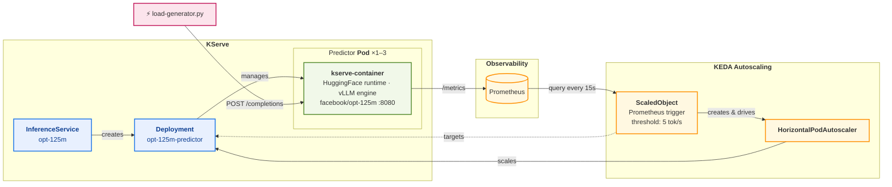

# KServe Autoscaling with KEDA and Custom Prometheus Metrics

This example demonstrates autoscaling a KServe InferenceService using
[KEDA](https://keda.sh/) with custom Prometheus metrics from vLLM.
It scales based on total token throughput rather than simple request count,
which is better suited for LLM inference workloads.

For full documentation, see the
[prokube autoscaling docs](https://docs.prokube.cloud/user_docs/model_serving_autoscaling/#keda-kubernetes-event-driven-autoscaling).

## Architecture



## Why Token Throughput?

LLM requests vary wildly in duration depending on prompt and output length.
Request-count metrics (concurrency, QPS) don't reflect actual GPU load.
Token throughput stays elevated as long as the model is under pressure,
making it a stable scaling signal.

## Prerequisites

- KEDA installed in the cluster — not available in all prokube clusters by default; see step 3 below
- Prometheus scraping vLLM metrics (prokube clusters include a cluster-wide PodMonitor)

## Files

| File | Description |
|------|-------------|
| `inference-service.yaml` | KServe InferenceService (OPT-125M, RawDeployment mode) |
| `scaled-object.yaml` | KEDA ScaledObject — scales on token throughput |
| `load-generator.py` | Python load generator with presets for different scaling scenarios |

## Quick Start

> [!NOTE]
> All of the examples below should be run in prokube notebook's terminal inside your cluster. The model created with RawDeployment is not accessible from outside the cluster by default.

```bash
# 1. Deploy the InferenceService
kubectl apply -f inference-service.yaml

# 2. Wait for it to become ready
kubectl get isvc opt-125m -w

# 3. Deploy the KEDA ScaledObject
kubectl apply -f scaled-object.yaml

# 4. Verify
kubectl get scaledobject
kubectl get hpa
```

> **NOTE 1.**  
> If step 3 fails with `no matches for kind "ScaledObject"`, KEDA is not installed in your cluster.
> Ask your admin to enable it.

  
> **NOTE 2.**  
> The Prometheus query in `scaled-object.yaml` has no `namespace` filter, so it aggregates token
> throughput across **all namespaces**. This is fine for testing, but if multiple users deploy a
> model named `opt-125m` at the same time, their metrics will interfere and autoscaling will be
> incorrect for both. For any real use, add a namespace filter to both queries in `scaled-object.yaml`:
>
> ```yaml
> query: >-
>   sum(rate(vllm:prompt_tokens_total{namespace="<your-namespace>",model_name="opt-125m"}[2m]))
>   + sum(rate(vllm:generation_tokens_total{namespace="<your-namespace>",model_name="opt-125m"}[2m]))
> ```

## See It in Action

After deploying, you can trigger autoscaling and observe the full scale-up / scale-down cycle.

### 1. Send a test inference request

Get the internal cluster address and send a request:

```bash
# inference service name + "-predictor"
SERVICE_URL=opt-125m-predictor

curl -s "$SERVICE_URL/openai/v1/completions" \
  -H "Content-Type: application/json" \
  -d '{"model":"opt-125m","prompt":"What is AI?","max_tokens":64}' \
  | python -c 'import json,sys;print("\n", json.load(sys.stdin)["choices"][0]["text"].strip(), "\n")'
```

### 2. Generate load to trigger scale-up

Use the included load generator to produce controlled, sustained load.
It has two presets calibrated for the opt-125m model on CPU:

| Mode | Workers | Sleep | Throughput | Scaling behavior |
|------|---------|-------|------------|------------------|
| `stable-2` | 1 | 8s | ~8 tok/s | Scales to 2 replicas and holds |
| `stable-3` | 2 | 2s | ~22 tok/s | Scales to 3 replicas and holds |

```bash
# Scale to 2 replicas (moderate load)
python load-generator.py --mode stable-2

# Scale to 3 replicas (heavy load)
python load-generator.py --mode stable-3

# Custom: pick your own concurrency and pacing
python load-generator.py --mode custom --workers 3 --sleep 1.0
```

Press `Ctrl+C` to stop the load at any time. By default the script runs for
10 minutes; override with `--duration`.

### 3. Observe autoscaling

You can use dashboards (recommended, see below) or get a compact summary in terminal:

```bash
# polls every 10 seconds
watch -n10 '
echo "Deployment:"
kubectl get deployment opt-125m-predictor

echo
echo "Autoscaler:"
kubectl get hpa keda-hpa-opt-125m-scaledobject
'
```

**Grafana dashboards** (prokube clusters): to visualize token throughput and replica count over time, see:

- General vLLM Dashboard:  
  https://YOUR_DOMAIN/grafana/d/b281712d-8bff-41ef-9f3f-71ad43c05e9b/vllm

- vLLM Performance Statistics:  
  https://YOUR_DOMAIN/grafana/d/performance-statistics/vllm-performance-statistics

- vLLM Query Statistics:  
  https://YOUR_DOMAIN/grafana/d/query-statistics4/vllm-query-statistics

- Replica count:  
  https://YOUR_DOMAIN/grafana/d/a164a7f0339f99e89cea5cb47e9be617/kubernetes-compute-resources-workload

Replace `YOUR_DOMAIN` with your cluster domain.

### Expected behavior

**Stable-2 mode** (~8 tok/s):
1. **1 replica** at rest
2. Load applied — metric rises to ~8 tok/s — `ceil(8/5) = 2` replicas needed
3. **Scaled to 2 replicas** within ~1 minute
4. Metric stabilizes at ~4 tok/s per replica (below threshold) — stays at 2
5. Load removed — metric drops to 0 — cooldown period (120s) + stabilization window (120s)
6. **Scaled back to 1** replica

**Stable-3 mode** (~22 tok/s):
1. **1 replica** at rest
2. Load applied — metric rises quickly — `ceil(22/5) = 5`, capped at `maxReplicas=3`
3. **Scaled to 3 replicas** within ~1-2 minutes
4. Load removed — gradual scale-down: 3 → 2 → 1 (one pod removed per minute)

## Scaling Math

The ScaledObject uses `metricType: AverageValue` with `threshold: 5`. For
external metrics, HPA computes:

```
desiredReplicas = ceil(totalMetricValue / threshold)
```

| Total tok/s | Desired replicas | Actual (capped 1-3) |
|-------------|------------------|---------------------|
| 0-5         | 1                | 1                   |
| 5.1-10      | 2                | 2                   |
| 10.1-15     | 3                | 3                   |
| 15+         | 4+               | 3 (maxReplicas)     |

## Customization

**Model name**: the `model_name="opt-125m"` filter in the Prometheus queries inside
`scaled-object.yaml` must match the `--model_name` argument in `inference-service.yaml`.

**Threshold**: the `threshold: "5"` value means "scale up when each replica
handles more than 5 tokens/second on average" (`AverageValue` divides the
query result by replica count). Tune this based on load testing for your
model and hardware.

**Load generator presets**: the presets in `load-generator.py` are calibrated for
opt-125m on CPU. If you change the model, hardware, or threshold, you'll need to
recalibrate. Use `--mode custom` to experiment, and watch the Prometheus metric:

```bash
# Check the actual metric value KEDA sees
kubectl run prom-check --rm -it --restart=Never --image=curlimages/curl -- \
  -s 'http://kube-prometheus-stack-prometheus.monitoring.svc.cluster.local:9090/prometheus/api/v1/query' \
  --data-urlencode 'query=sum(rate(vllm:prompt_tokens_total{model_name="opt-125m"}[2m])) + sum(rate(vllm:generation_tokens_total{model_name="opt-125m"}[2m]))'
```

**GPU deployments**: remove `--dtype=float32` and `--max-model-len=512`
from the InferenceService args, add GPU resource requests, and consider
adding a second trigger for GPU KV-cache utilization:

```yaml
# Add to scaled-object.yaml triggers list
- type: prometheus
  metadata:
    serverAddress: http://kube-prometheus-stack-prometheus.monitoring.svc.cluster.local:9090/prometheus
    query: >-
      avg(vllm:gpu_cache_usage_perc{model_name="my-model"})
    metricType: AverageValue
    threshold: "0.75"
```

## References

- [prokube autoscaling documentation](https://docs.prokube.cloud/user_docs/model_serving_autoscaling/)
- [KServe KEDA autoscaler docs](https://kserve.github.io/website/docs/model-serving/predictive-inference/autoscaling/keda-autoscaler)
- [KEDA Prometheus scaler](https://keda.sh/docs/scalers/prometheus/)
- [vLLM metrics reference](https://docs.vllm.ai/en/latest/serving/metrics.html)
