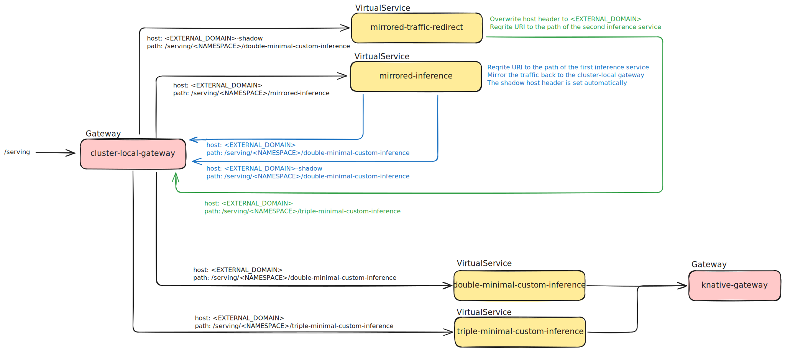

# Istio Networking

Traffic mirroring is implemented with two Istio `VirtualService` resources.



## How it works

**mirrored-inference-virtual-service.yaml** — the entry point. It matches requests
on the `mirrored-inference` path, routes them to the primary ISVC
(`double-minimal-custom-inference`) via `cluster-local-gateway`, and simultaneously
mirrors 100 % of traffic back to `cluster-local-gateway`. When Istio mirrors a
request it automatically appends `-shadow` to the `Host` header of the mirrored
copy (e.g. `plus-muskrat.prokube.cloud` → `plus-muskrat.prokube.cloud-shadow`).
The caller only ever receives the primary's response; the shadow response is silently
discarded.

**mirrored-traffic-redirect-virtual-service.yaml** — intercepts the mirrored copy.
It matches on the `-shadow` host and the primary ISVC path, rewrites the URI to the
shadow ISVC path, and resets the `Host` header back to the real domain so
`cluster-local-gateway` can route it to the shadow ISVC (`triple-minimal-custom-inference`).

## Customisation

Before applying, update the following placeholders in both files:

| Placeholder | Replace with |
|---|---|
| `<domain.example.com>` | Your cluster's external domain (e.g. `plus-muskrat.prokube.cloud`) |
| `<namespace>` | Your profile namespace (e.g. `prokube-demo-profile`) |

The `uri` paths follow the KServe convention:
`/serving/<namespace>/<inference-service-name>/`

## Deploy

```bash
kubectl apply -k .
```
